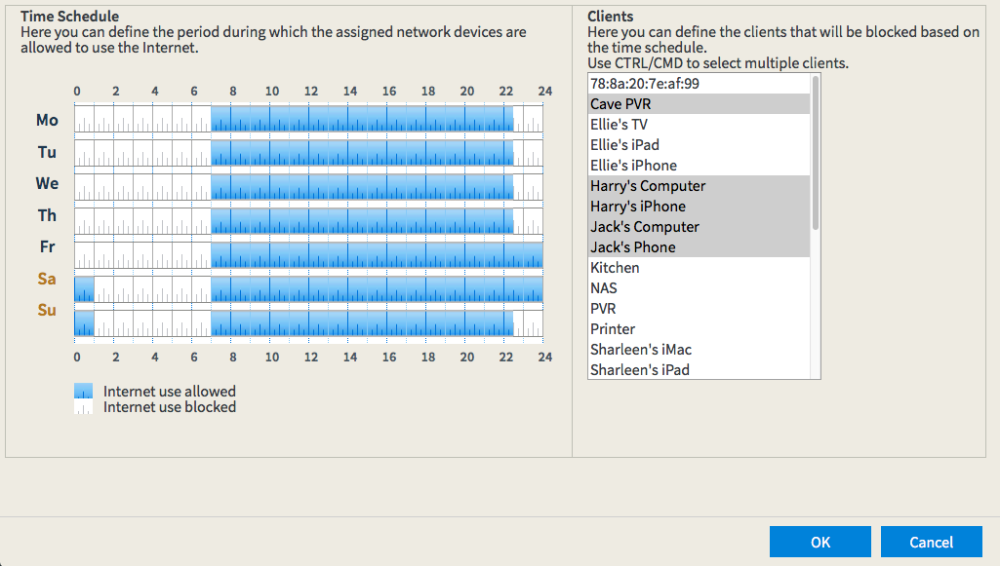

# Unifi-parental

Time based block/unblock of clients for a Unifi based network.

## Requires
* a Unifi Controller accessible over the network
* NodeJS **v7.10.x** or later (the latest LTS should suffice)
* openssl installed to generate self signed ssl certificate

Uses:
* node-unifi to access the Unifi Controller.
* node-schedule for cron like scheduling of the block/unblock actions

## Installation
Clone the repo and then do:
1. ```npm install```

2. Generate a self signed certificate using `generate-ssl-cert.sh` - this requires `openssl` to be installed. Alternatively a certificate from [Lets Encrypt](https://letsencrypt.org) using standalone authintication with [CertBot](https://certbot.eff.org) could be used.

3. Add certificate information, Unifi Controller details and login information to `config.json` and `.env` respectively - see `-sample` files for examples (if you copy the sample files, remove the comments ... `/* xxx */`)

4. Start the server:
```
DEBUG=unifi-parental:* npm start
```

Fire up a browser and head to https://localhost:4000/ to access the interface.



Click `Save` to send the schedule to the server and to schedule the block/unblock actions. This is required to be done initially every time the server is started. (ie: the schedule is not applied on startup of the server)

## Note
The code (javascript, html, css, images and fonts) for the time schedule chart were saved using a browser from a Fritz!Box 7390 ADSL modem/router. The source files served to the browser contained no license information.

The file `public\js\timer.js` has been modified to return data in a more usable format for both the client and server. Portions of this file have been used in the server side code for scheduling block/unblock actions.

## TODO
* [x] Generate block/unblock schedule on startup
* [x] Check if clients should be blocked/unblocked at the time the schedule is applied
* [x] Keep track of the login state with the Unifi Controller better
* [x] Error handling if the login state is stale
* [x] Tidy up the client UI
  * [x] ~~make the Cancel button actually do something~~
  * [x] show some confirmation that the schedule has been applied on the server
